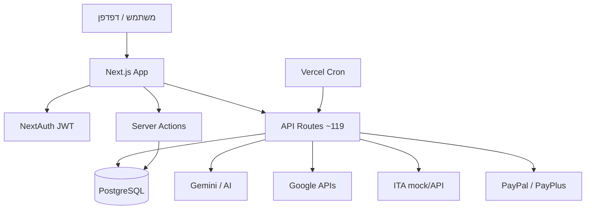

# איפיון מערכת BSD-YBM-OS

**גרסת מסמך:** 18/05/2026  
**מאגר:** `sysybu-hash/bsd-ybm-os`  
**פרודקשן:** https://bsd-ybm.co.il  
**דיפלוי אחרון:** commit `7c7588e` — Production READY (Vercel)

---

## 1. תקציר מנהלים

BSD-YBM-OS היא **מערכת הפעלה עסקית מבוססת דפדפן** לענף הבנייה והקבלנות בישראל. המערכת מאחדת workspace מרובה-חלונות (ווידג'טים), CRM, ERP, הפקת מסמכים פיננסיים, סריקת חשבוניות ב-AI, אינטגרציות Google ו-Meckano, וניהול מנויים — הכל תחת ארגון (multi-tenant) עם הרשאות תפקיד.

### יעדי מוצר עיקריים

| יעד | מימוש |
|-----|--------|
| ניהול פרויקטים ולקוחות | CRM, לוח פרויקטים, משימות |
| מסמכים וחשבונאות | הפקת חשבוניות, PDF, מע״מ, מספר הקצאה |
| אוטומציה משרדית | סריקה → ERP, Drive, NotebookLM |
| עוזר חכם | Omnibar, אוטומציות טבעיות, Gemini Live |
| תפעול שטח | Meckano, דוחות נוכחות |
| מנוי וחיוב | PayPal, PayPlus, מכסות סריקה |

---

## 2. ארכיטקטורה טכנית

| שכבה | טכנולוגיה |
|------|-----------|
| Frontend | Next.js 15 (App Router), React 18, Tailwind CSS, Framer Motion |
| Backend | Route Handlers + Server Actions |
| DB | PostgreSQL (Neon) + Prisma 6 |
| Auth | NextAuth 4 (Google OAuth + Credentials) |
| AI | Vercel AI SDK, Gemini, OpenAI, Anthropic, Document AI |
| Analytics | PostHog (EU) |
| Hosting | Vercel (Cron, Serverless Functions) |
| PDF עברי | `@react-pdf/renderer` + Noto Sans Hebrew |

### דיאגרמת זרימה כללית



---

## 3. מודל משתמשים והרשאות

### 3.1 תפקידים (`UserRole`)

| תפקיד | הרשאות עיקריות |
|--------|----------------|
| `SUPER_ADMIN` | קונסולת פלטפורמה, broadcast, תיקון תפקידים |
| `ORG_ADMIN` | הגדרות ארגון, שיוך משתמשים, כל ה-workspace |
| `PROJECT_MGR` | פרויקטים, CRM, מסמכים |
| `EMPLOYEE` | workspace מוגבל לפי launcher |
| `CLIENT` | ברירת מחדל — לקוח קצה / מנוי |

### 3.2 ארגון (`Organization`)

- **זיהוי:** שם, ח.פ (`taxId`), כתובת, מיתוג (`tenantSiteBrandingJson`)
- **מע״מ:** `vatRatePercent` (ברירת מחדל 18%), `companyType`, `isReportable`
- **מנוי:** `SubscriptionTier`, `subscriptionStatus`, `trialEndsAt`, מכסות סריקה
- **תשלומים:** PayPal slug/email, מפתח Meckano
- **ענף:** `industry`, `constructionTrade`, `industryConfigJson`

### 3.3 אימות

- התחברות Google OAuth + אימייל/סיסמה
- Middleware מגן על `/api/*` (חריגים: auth, webhooks, cron, sign, register)
- חיבור מחדש ל-Google ל-Drive/Gemini Live

---

## 4. ממשק משתמש — Workspace

### 4.1 מעטפת

| רכיב | תיאור |
|------|--------|
| `OmniCanvasWorkspace` | שורש ה-workspace למשתמש מחובר |
| `OSWorkspace` | ניהול חלונות (מינימום/מקסימום/סגירה) |
| `OSSidebar` / `MobileBottomNav` | ניווט — מותאם Launcher |
| `Omnibar` | פקודות טבעיות + אוטומציות |
| `NotificationCenter` | התראות in-app |
| `FirstDayWizard` | אשף יום ראשון |
| `FileDropzone` | גרירת קבצים לסריקה |

### 4.2 Launcher (התאמה אישית)

משתמש/מנהל יכול לערוך:

- **אזורים:** `quickGrid`, `sidebar`, `mobileBarStart`, `mobileBarEnd`, `mobileMore`
- **פעולות:** גרירה, הסתרה, החלפת ווידג'ט
- **אחסון:** `localStorage` (per-user)
- **קבצים:** `lib/launcher/*`, `components/os/launcher/*`

### 4.3 קטלוג ווידג'טים

| מזהה | שם | תפקיד |
|------|-----|--------|
| `dashboard` | דאשבורד פיננסי | KPI, הכנסות/הוצאות |
| `projectBoard` | לוח פרויקטים | קנבן משימות |
| `crmTable` | CRM | אנשי קשר, סטטוס עסקה |
| `erpArchive` | ארכיון ERP | מסמכים סרוקים |
| `docCreator` | הפקת מסמכים | חשבוניות והצעות |
| `aiScanner` | סורק AI | Tri-Engine, תור סריקה |
| `aiChatFull` | צ'אט AI | שיחה מלאה |
| `notebookLM` | NotebookLM | מחברות, צ'אט, אודיו |
| `googleDrive` | Google Drive | סנכרון, פענוח, שמירה |
| `meckanoReports` | Meckano | דוחות נוכחות |
| `settings` | הגדרות | פרופיל, מע״מ, Drive, משתמשים |
| `project` | פרויקט | פרטי פרויקט בודד |
| `cashflow` | תזרים | תחזית מזומנים |
| `erp` | מסמכי ERP | רשימת מסמכים |
| `accessibility` | נגישות | הגדרות נגישות |
| `helpCenter` | עזרה | מדריכים רב-לשוניים |
| `platformAdmin` | ניהול מערכת | SUPER_ADMIN בלבד |

---

## 5. מודול מסמכים וחשבונאות (ERP פיננסי)

### 5.1 סוגי מסמכים (`DocType`)

| סוג | תווית | מספר הקצאה מעל סף |
|-----|--------|-------------------|
| `QUOTE` | הצעת מחיר | לא |
| `TRANSACTION_INVOICE` | חשבונית עסקה | כן |
| `INVOICE` | חשבונית מס | כן |
| `INVOICE_RECEIPT` | חשבונית מס וקבלה | כן |
| `RECEIPT` | קבלה | לא |
| `CREDIT_NOTE` | חשבונית זיכוי | כן |

### 5.2 מע״מ

- ברירת מחדל: **18%** (`lib/vat-config.ts`)
- ניתן לשינוי בהגדרות ארגון → `Organization.vatRatePercent`
- חישוב: `lib/billing-calculations.ts` — נטו, מע״מ, סה״כ; פטור לפי `EXEMPT_DEALER`

### 5.3 מספר הקצאה (ITA) — 2026

| תקופה | סף (לפני מע״מ) |
|--------|----------------|
| 01/01/2026 – 31/05/2026 | ₪10,000 |
| מ-01/06/2026 | ₪5,000 |

- לוגיקה: `lib/ita-allocation-rules.ts`, `lib/services/ita-service.ts`
- שדה DB: `IssuedDocument.itaAllocationNumber`
- **פרודקשן ללא `ITA_PRODUCTION_KEY`:** מצב mock (מספר דמה)
- **עם מפתח + מימוש API:** חיבור לרשות המסים (ממתין למימוש מלא בקוד)

### 5.4 הפקה וייצוא

| פעולה | נתיב / קובץ |
|--------|-------------|
| יצירת מסמך | `POST /api/erp/issued-documents` |
| עדכון | `PATCH /api/erp/issued-documents/[id]` |
| תצוגה/עריכה | `InvoiceDocumentView` |
| PDF | `GET /api/documents/issued/[id]/export?format=pdf` |
| DOCX (HTML) | `?format=docx` |
| עיצוב PDF | `lib/pdf/InvoiceDocument.tsx` |
| תצוגה מקדימה | `DocumentPreview.tsx` |
| תזכורת תשלום | `POST .../send-reminder` + מייל מצורף PDF |

### 5.5 הצעות מחיר וחתימה

- מודל `Quote` + token
- דף חתימה: `/sign/[id]`
- API: `/api/sign/[id]`, `/api/erp/quotes`
- אופציונלי: קישור PayPlus

### 5.6 גבייה אוטומטית

- Cron: ראשון 08:00 — `/api/cron/collection-reminders`
- לוגיקה: `lib/collection/run-collection-cron.ts`

---

## 6. CRM ופרויקטים

### 6.1 אנשי קשר

- CRUD: `/api/crm/contacts`, `app/actions/crm.ts`
- ייבוא: `/api/crm/import`
- חיפוש סמנטי: `/api/crm/semantic-search`
- סגירת עסקה (`CLOSED_WON`) → יצירת חשבונית אוטומטית (אם אין)

### 6.2 פרויקטים

- רשימה/פרטים: `/api/projects`, `/api/projects/detail`
- עדכון: `/api/projects/update`
- הערות: `/api/projects/[id]/notes`
- שיוך מסמך לפרויקט: `IssuedDocument.projectId`

### 6.3 לוח משימות

- `ProjectBoardWidget` — עמודות סטטוס
- תזכורות: cron יומי 07:00 — `/api/cron/task-reminders`

---

## 7. סריקה ו-AI

### 7.1 Tri-Engine

- נתיבים: `/api/scan/tri-engine`, `.../stream`
- מנועים: Gemini, Document AI, OpenAI (לפי זמינות מפתחות)
- סכמה: `lib/scan-schema-v5.ts`
- הקשר מקצוע: `lib/construction-trades.ts` (10 מקצועות בנייה)

### 7.2 תור סריקה

- הוספה: `/api/analyze-queue/add`
- עיבוד: `/api/analyze-queue/process` (גם cron 06:15)
- סטטוס: `/api/analyze-queue/status`

### 7.3 זרימה סריקה → ERP

1. העלאה / Drive / גרירה  
2. ניתוח AI  
3. אישור → `ExpenseRecord` / `Document`  
4. אופציונלי: NotebookLM, השוואת מחירים

### 7.4 עוזר OS (Omnibar)

- פרשנות כוונה: `/api/os/assistant/interpret`
- ביצוע כלים: `/api/os/assistant/execute-tool`
- **35 כוונות** ב-`lib/os-automations/catalog.ts` (פתיחת ווידג'ט, הפקת חשבונית, סריקה, Meckano וכו')

### 7.5 Gemini Live / קול

- `/api/ai/gemini-live/session`
- `/api/ai/omni-voice`
- הגדרות: `GeminiLiveSettingsSheet`

### 7.6 NotebookLM

- מחברות מקומיות ב-DB
- API: `/api/notebooklm/*`
- צ'אט, חילוץ PDF, סקירת אודיו
- קישור מ-Drive: `/api/os/google-drive/to-notebook`

### 7.7 תובנות פיננסיות

- Cron יומי 06:00: `/api/cron/financial-insights`
- מודל: `FinancialInsight`

---

## 8. אינטגרציות חיצוניות

| שירות | סטטוס | הערות |
|--------|--------|--------|
| Google OAuth | פעיל | התחברות + הרשאות |
| Google Drive | פעיל | סנכרון, פענוח batch, העלאה |
| Google Calendar | Stub | `lib/services/google-calendar.ts` |
| Gemini | פעיל | מודלים ב-`lib/gemini-model.ts` |
| Document AI | לפי env | חשבוניות סרוקות |
| PayPal | פעיל | מנוי + webhooks |
| PayPlus | לפי env | תשלומי הצעות |
| Meckano | פעיל | מפתח per-org |
| ITA | Mock | עד `ITA_PRODUCTION_KEY` + מימוש |
| PostHog | פעיל | אירועי מוצר |
| Resend/Nodemailer | פעיל | מיילים טרנזקציוניים |

---

## 9. דפים ציבוריים ומנהלה

### 9.1 דפים

| נתיב | תוכן |
|------|------|
| `/` | נחיתה / workspace |
| `/login` | התחברות |
| `/about`, `/legal`, `/privacy`, `/terms` | מידע ומשפטי |
| `/help` | מרכז עזרה |
| `/integrations/google` | חיבור Google |
| `/app/admin` | קונסולת SUPER_ADMIN |
| `/sign/[id]` | חתימה דיגיטלית |

### 9.2 קונסולת אדמין

- בריאות מערכת, לוגים, broadcast, תיקון תפקידים, סיסמאות
- API: `/api/admin/*`

---

## 10. Cron Jobs (Vercel)

| שעה (UTC cron) | נתיב | תפקיד |
|----------------|------|--------|
| 06:00 יומי | `/api/cron/financial-insights` | תובנות AI |
| 06:15 יומי | `/api/analyze-queue/process` | תור סריקה |
| 07:00 יומי | `/api/cron/task-reminders` | תזכורות משימות |
| 08:00 ראשון | `/api/cron/collection-reminders` | תזכורות גבייה |

**דרישה:** `CRON_SECRET` בפרודקשן (אחרת routes נדחים).

---

## 11. בינלאומיות (i18n)

| שפה | קוד | RTL |
|-----|-----|-----|
| עברית | `he` | כן |
| אנגלית | `en` | לא |
| רוסית | `ru` | לא |

קבצים: `messages/*.json`, `lib/i18n/*`, עזרה: `lib/help-center/content.*.ts`

---

## 12. אבטחה ותאימות

- JWT לכל API מוגן
- Webhooks: PayPal, PayPlus — ללא auth (חתימה/סוד)
- Rate limiting: מודל `RateLimit`
- לוג פעילות: `ActivityLog`
- `/.well-known/security.txt`
- GDPR: שדות משפטיים ב-env (`NEXT_PUBLIC_LEGAL_*`)

---

## 13. בדיקות איכות

| סוג | קבצים |
|-----|--------|
| Jest | `lib/**/__tests__`, `app/api/register/route.test.ts` |
| Playwright E2E | `e2e/site-quality`, `workspace-automations`, `workspace-a11y`, `help-center-i18n`, `launcher-customization` |
| סקריפטים | `npm run verify`, `verify:all`, `premerge` |

---

## 14. משתני סביבה קריטיים

| משתנה | שימוש |
|--------|------|
| `DATABASE_URL` | PostgreSQL |
| `NEXTAUTH_SECRET`, `NEXTAUTH_URL` | אימות |
| `GOOGLE_CLIENT_ID/SECRET` | OAuth |
| `GOOGLE_GENERATIVE_AI_API_KEY` | Gemini |
| `CRON_SECRET` | Cron |
| `ANALYZE_QUEUE_SECRET` | תור סריקה |
| `ITA_PRODUCTION_KEY` | מספר הקצאה |
| `NEXT_PUBLIC_POSTHOG_*` | אנליטיקה |
| PayPal / PayPlus keys | תשלומים |

רשימה מלאה: `.env.example`, `docs/DEPLOY.md`

---

## 15. מסד נתונים — ישויות עיקריות

```
Organization ─┬─ User
              ├─ Project ─ Task
              ├─ Contact
              ├─ IssuedDocument (DocType, ITA, VAT)
              ├─ Document / DocumentLineItem
              ├─ ExpenseRecord
              ├─ Quote
              ├─ Notebook (+ sources, messages)
              ├─ CloudIntegration / DriveSyncEntry
              └─ MeckanoZone

Platform: PlatformSettings, OSBillingConfig, ScanBundle
Auth: Account, Session, VerificationToken
```

---

## 16. שינויים אחרונים (דיפלוי 18/05/2026)

1. **Launcher** — התאמה אישית של סרגל ו/quick actions  
2. **מסמכים** — 6 סוגים, PDF מעוצב, תצוגה מקדימה  
3. **מע״מ 18%** — הגדרה בארגון + חישוב אחיד  
4. **ITA 2026** — ספים 10k/5k לפני מע״מ  
5. **Cron** — תזכורות משימות וגבייה  
6. **אשף יום ראשון** — onboarding  
7. **תזכורת מסמך** — מייל + PDF מצורף  

---

## 17. מפת דרכים טכנית (מומלץ)

| עדיפות | פריט |
|--------|------|
| גבוה | מימוש API רשמי ITA אחרי קבלת מפתח |
| גבוה | `CRON_SECRET` + `ANALYZE_QUEUE_SECRET` ב-Vercel אם חסרים |
| בינוני | השלמת Google Calendar (מעבר מ-stub) |
| בינוני | מיגרציות Prisma מסודרות (לא רק `db push`) |
| נמוך | Stripe (שדות קיימים, ללא שימוש) |

---

## 18. נספח — מפת API (לפי תחום)

<details>
<summary>לחץ להרחבה — רשימת API מלאה</summary>

### אימות
- `/api/auth/[...nextauth]`, `/api/auth/google-*`, `/api/register`, `/api/assign-user`

### ארגון
- `/api/organization`, `/api/org/*`, `/api/dashboard/stats`, `/api/search`

### אדמין
- `/api/admin/health`, `system-health`, `check-user`, `fix-roles`, `platform-settings`, `broadcast-notification`, `logs`

### AI / סריקה
- `/api/ai/*`, `/api/analyze*`, `/api/scan/*`, `/api/chat`

### OS
- `/api/os/assistant/*`, `/api/os/automations/*`, `/api/os/google-drive/*`

### NotebookLM
- `/api/notebooklm/*`

### ERP / מסמכים
- `/api/erp/*`, `/api/documents/issued/*`, `/api/expenses/confirm`, `/api/quotes`, `/api/sign/[id]`

### CRM / פרויקטים
- `/api/crm/*`, `/api/projects/*`

### Meckano
- `/api/meckano/*`

### חיוב
- `/api/billing/paypal/*`, `/api/webhooks/paypal`, `/api/webhooks/payplus`

### Cron
- `/api/cron/financial-insights`, `task-reminders`, `collection-reminders`, `/api/analyze-queue/process`

</details>

---

*מסמך זה נוצר אוטומטית מהקוד והדיפלוי ב-18/05/2026. לעדכונים שוטפים — עדכנו לפי שינויי schema ו-`lib/os-assistant/widget-catalog.ts`.*
